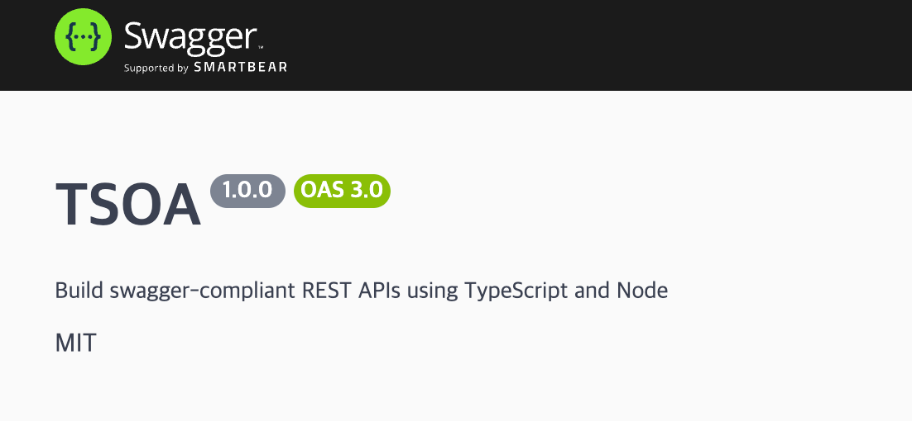

새롭게 참여한 팀에서 API 스펙을 공유해달라는 요청을 받았다.
해당 팀은 API 스펙을 Postman 의 Request 로 공유하고 있었다.

내가 볼땐 매번 변경사항이 있을때마다 Request 를 갱신하는 것도 어렵지만, 
Request 는 사용예시이기에 정확한 스펙을 공유하기엔 맞지 않다고 생각했다.
실제로 시간이 지남에 따라 스펙이 맞지 않는 문제를 겪고 있었다.

나는 이 문제를 해결하기 위해 OpenAPI Specification (OAS) 를 사용하기로 했다.
OAS 는 Postman 의 APIs 서비스나 Swagger 라이브러리로 간단하게 UI 를 제공할 수 있다.
전자는 버전에 따라 API 스펙을 공유할 수 있고, 후자는 API 스펙을 코드로 생성할 수 있다.
나는 후자를 선택했다.

## Node.js 의 Decorator

코드로 API 스펙을 생성하는 방법은 메타데이터를 관리하는 것으로 시작된다.
메타데이터는 코드의 구조정보인데, Node.js 진영에서는 이를 TypeScript 의 Decorator 로 관리할 수 있다.

다음은 Decorator 를 사용하기 위한 tsconfig.json 의 설정이다.

```json
{
  "compilerOptions": {
    "experimentalDecorators": true,
    "emitDecoratorMetadata": true
  }
}
```

- experimentalDecorators 는 데코레이터 문법 (e.g. Class, Method) 을 사용할 수 있도록 한다.
- emitDecoratorMetadata 는 런타임에 메타데이터를 메모리에 적재하여 사용할 수 있도록 한다.

> eperimental 접두사가 붙인 것은 아직 ECMAScript 표준이 아니기 때문이다.
ECMAScript 표준화는 총 4단계를 거치며 3단계 이상이 되어야 엔진에 포함될 있다.
현재 Decorator 는 3단계에 있으며, TypeScript 는 이를 사용할 수 있도록 experimentalDecorators 옵션을 제공한다.

## Nest.js vs TSOA

이제 메타데이터를 사용해서 OAS 를 작성해주는 라이브러리를 도입하면 된다.
Node.js 진영에서는 대표적으로 두가지 선택지가 있다.

1. Nest.js 프레임워크를 사용한다.
2. TypeScript OpenAPI (TSOA) 라이브러리를 사용한다.

Nest 프레임워크를 사용하면 해당 진영에서 제공해주는 파워풀한 모듈들이 Decorator 패턴을 기반으로 쉽게 설정된다.
만약 내가 Node.js 기반의 프로젝트를 신규로 시작한다면 전자를 선택했을 것이다.
하지만 나는 Express.js 기반의 레거시 프로젝트에서 스펙문서를 제공해야하는 상황이기에 
비교적 수정범위가 적은 TSOA 를 선택했다. TSOA 는 Interface 계층만 수정해주면 된다.

## TSOA 설치하기

우선 TSOA 를 설치한다.

```shell
npm install tsoa
```
다음은 TSOA 를 사용하기 위한 tsconfig.json 의 설정이다.

```json
{
  "compilerOptions": {
    "target": "es2021"
  }
}
```

> TSOA 에서 Promise.any 사용한다. 
> Promise.any 는 es2021 에서부터 제공된다. 
> es2021 는 Node.js 버전 16부터 지원된다.

이제 TSOA 를 설정할 차례이다.
프로젝트 루트에 tsoa.json 파일을 생성하고 다음과 같이 작성한다.

```json
{
  "entryFile": "app.js", // Express.js 의 entry file 을 지정한다.
  "noImplicitAdditionalProperties": "throw-on-extras", // 요청 객체에 정의되지 않은 프로퍼티가 있을때 에러를 발생시킨다.
  "controllerPathGlobs": [
    "controllers/**/*Controller.ts" // 컨트롤러 파일의 위치를 지정한다.
  ],
  "spec": { // OAS 파일을 생성할 때 필요한 설정을 지정한다.
    "outputDirectory": "./auto_generated/tsoa/swagger", // OAS 파일을 생성할 위치를 지정한다.
    "specVersion": 3, // OAS 버전을 지정한다.
    "securityDefinitions": {
      "sessionAuth": { // 내가 사용할 보안방식의 이름을 지정하고 OAS 에 나타낼 보안방식을 정의한다. (실제 보안처리는 직접 작성한 모듈에서 진행한다.)
        "type": "apiKey", 
        "name": "Cookie",
        "in": "header"
      }
    }
  },
  "routes": { // 라우터 파일을 생성할 때 필요한 설정을 지정한다.
    "routesDir": "./auto_generated/tsoa/routes", // 라우터 파일을 생성할 위치를 지정한다.
    "authenticationModule": "./middleware/tsoa/expressAuthentication.ts" // 인증 모듈을 지정한다.
  },
  "compilerOptions": {
    "baseUrl": "../",
    "paths": {
      "@*":  ["./*"] // tsconfig.json 에서 지정한 symbolic link 를 tsoa 에도 지정해준다.
    }
  }
}

```

TSOA 설정은 크게 인터페이스를 담당하는 Route 코드와 이를 문서화한 OAS 파일을 생성하는 설정으로 나뉜다.
파일경로는 tsoa.json 기준으로 지정하면 된다.

## TSOA 코드 작성하기

### Controller 작성하기 

```typescript
import { Controller, Route, Get, Post, Body, SuccessResponse } from 'tsoa';

@Route('/tsoa-samle')
export class TsoaSampleController extends Controller {
  @Get('/data/{id}')
  @Security('sessionAuth')
  public async getData(
    @Request() req: any, // Request 객체 : 모듈에 의해 인증 & 저장된 사용자 정보를 가져올 수 있다. (i.e. req.user.id)
    @Path('dataId') dataId: number, // Path Parameter
    @Query('optionId') optionId: number, // Query Parameter
  ): Promise<Data> {
    return { id: dataId, name: 'data' };
  }
}
```

### 인증 모듈 작성하기

```typescript
import { Request } from 'express';

export const expressAuthentication = async (
  request: Request,
  securityName: string,
  scopes?: string[],
): Promise<any> => {
  if (securityName === 'sessionAuth') { // 지정한 이름으로 인증처리를 분류한다.
    return new Promise((resolve, reject) => {
      if (!req.isAuthenticated()) { // 인증 여부를 확인한다.
        reject(new Error('Unauthorized or limit exceeded'));
      } else {
        resolve(request.user);
      }
    });
  }
  throw new Error(`Unsupported security method: ${securityName}`);
};
```

### 에러 핸들러 작성하기

TSOA 의 에러를 어플리케이션에서 사용중이던 에러포맷으로 치환한다.

```typescript
import { ValidateError } from 'tsoa';
import type express from 'express';

export class TSOAErrorHandler {
  private static isValidateError(err: unknown): err is ValidateError { // 타입가드 함수로 에러를 캐스팅합니다.
    return (
      typeof err === 'object' && err !== null && 'fields' in err && typeof (err as ValidateError).fields === 'object'
    );
  }

  public static handleValidateError( // TSOA 에러 발생시키는 에러를 어플리케이션 에러로 치환합니다.
    err: Error,
    req: express.Request,
    res: express.Response,
    next: express.NextFunction,
  ): void {
    if (!this.isValidateError(err)) {
      next(err);
    } else {
      const newError = new CustomException(JSON.stringify(err.fields), 400);
      newError.stack = err.stack; // StackTrace 이력을 유지합니다.
      next(newError);
    }
  }
}
```

에러 모듈을 기존 에러핸들러보다 먼저 등록한다. (next 로 처리되기에 순서가 중요하다.)

```typescript
// TSOA 에러 핸들러 등록 : 기존 에러형태로 파싱하여 체이닝
app.use((err, req, res, next) => {
  TSOAErrorHandler.handleValidateError(err, req, res, next);
});
```

### 라우터 생성하기

TSOA 는 작성된 Controller 를 기반으로 라우터 JS 파일을 생성한다.

```shell
npx tsoa routes 
```

생성된 파일에서 export 된 RegisterRoutes 함수로 앱에 라우터를 등록할 수 있다.

```typescript
// TSOA 라우트 등록
const { RegisterRoutes } = require('./auto_generated/tsoa/routes/routes'); // tsoa.json 에 설정한 위치
RegisterRoutes(express());
```

### Swagger UI 생성하기

TSOA 는 작성된 Controller 를 기반으로 OAS 를 생성한다.

```shell
npx tsoa spec 
```

생성된 파일을 Swagger UI 에서 사용할 수 있도록 설정한다.

```typescript
// Swagger UI 설정
const swaggerUi = require('swagger-ui-express');
const swaggerDocument = require('./auto_generated/tsoa/swagger/swagger'); // tsoa.json 에 설정한 위치
app.use('/docs', swaggerUi.serve, swaggerUi.setup(swaggerDocument));
```

지정한 `/docs` 로 접근하면 Swagger UI 문서를 확인할 수 있다.



이제 해당 URL 을 팀에 공유하면 된다.
